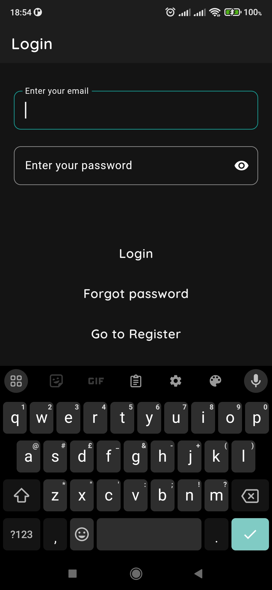

# Flutter_Firebase

A note taking mobile application built with Flutter and Firebase as the backend service.

## Table of Contents

- [Features](#features)
- [Development Setup](#development-setup)
- [Project Configuration](#project-configuration)
- [Contributing](#contributing)
- [Flutter Generated](#learn-flutter)
- [App Screenshots](#app-screenshots)

## Features

- A user can sign up with an email.
- Email verification via link.
- Verified users can view, add, delete and updates their notes.

## Development Setup

To get the project up and running on your local machine.

### Prerequisites

- [Flutter SDK](https://docs.flutter.dev/get-started/install/linux)
- [Android Studio](https://developer.android.com/studio)
- [XCode](https://developer.apple.com/xcode/)
  > Please make sure that you set up your [editor](https://docs.flutter.dev/get-started/editor) to support flutter.

## Project Configuration

Run following commands from project root directory to get the project up and running on debug mode.

#### 1. Install dependencies

```
flutter pub get
```

#### 2. Build the app

```
flutter run || flutter run --flavor dev
```

## Contributing

We welcome and encourage any contributions to the project whether it be a bug report, bug fix or a new possible feature. If you would like to start with any contributions, please follow the [contributing guidelines](.github/CONTRIBUTING.md).

## Learn Flutter

This project is a starting point for a Flutter application.

A few resources to get you started if this is your first Flutter project:

- [Lab: Write your first Flutter app](https://docs.flutter.dev/get-started/codelab)
- [Cookbook: Useful Flutter samples](https://docs.flutter.dev/cookbook)

For help getting started with Flutter development, view the
[online documentation](https://docs.flutter.dev/), which offers tutorials,
samples, guidance on mobile development, and a full API reference.

## App Screenshots




> Find more screenshots [here](./assets/screenshots/).
